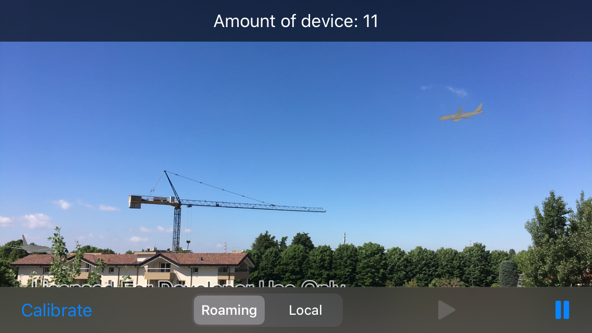
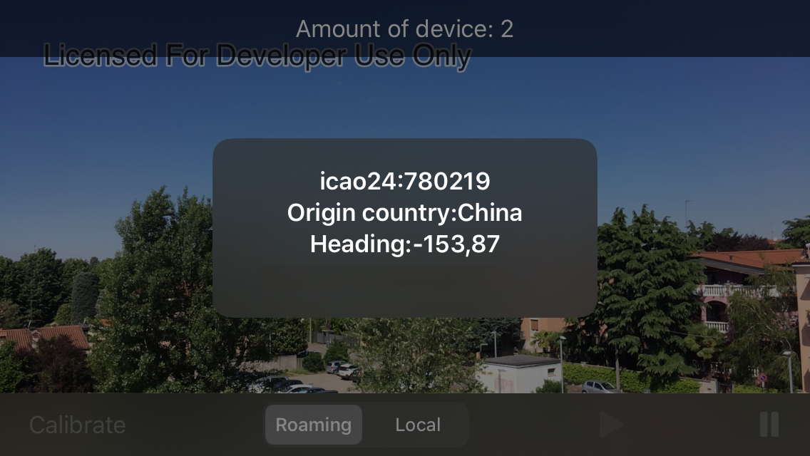

# Augmented Reality OpenSky

## Description
This augmented reality proof of concept allows you to visualize airplanes in real time in the radius (extent) chosen among preferences from the user buffer using a web service [OpenSky](https://openskynetwork.github.io/opensky-api/rest.html) which points the airplanes' positions in real time. 
In case, you could use any other web service as long as it gives you the same information.

If you register on [OpenSky](https://opensky-network.org/) you can set user and password so you can retrieve data with a time resolution of 5 seconds.
 
Anonymous users can only retrieve data with a time resolution of 10 seconds.
 

## Requirements
[ArcGIS Runtime ARToolkit 100.14.0](https://www.nuget.org/packages/Esri.ArcGISRuntime.ARToolkit/)

[Xamarin.iOS](https://docs.microsoft.com/it-it/xamarin/ios/)

## Relevant API

* ARSceneView
* GraphicsOverlay
* SceneView
* Surface

## About the data

Airplanes are created from a collada model [Boeing787](https://www.arcgis.com/home/item.html?id=21274c9a36f445db912c7c31d2eb78b7) 

## Additional information

This sample requires a device that is compatible with ARKit 1 on iOS.

There are two main approaches for identifying the physical location of tapped point:

* **ARSceneView.ARScreenToLocation** - uses plane detection provided by ARKit to determine where _in the real world_ the tapped point is.
ARScreenToLocation will only return a result if ARCore is able to detect a plane/surface at the tapped location.
In the image, the green tree is a real-world object, and the yellow ray represents what is at the tapped screen location.
With ARScreenToLocation, if there is a physical object, the real-world location of the tapped real-world object is returned. If there is no object, or ARCore/ARKit fails to detect the object, nothing is returned. When you use the existing non-AR ScreenToLocation method, the location of the virtual scene object at the tapped point is returned. In the illustration above, that ends up being the basemap, which is very far away from the tree.

  

* **SceneView.ScreenToLocation** - determines where the tapped point is _in the virtual scene_. This is problematic when the opacity is set to 0 and you can't see where on the scene that is. Real-world objects aren't accounted for by the scene view's calculation to find the tapped location; for example tapping on a tree might result in a point on the basemap many meters away behind the tree.

This sample only uses the `ARScreenToLocation` approach, as it is the only way to get accurate positions for features not directly on the ground in real-scale AR.

Note that unlike other scene samples, a basemap isn't shown most of the time, because the real world provides the context. Only while calibrating is the basemap displayed at 50% opacity, to give the user a visual reference to compare to.

**Real-scale AR** is one of three main patterns for working with geographic information in augmented reality. See [Augmented reality](https://developers.arcgis.com/net/latest/ios/guide/display-scenes-in-augmented-reality.htm) in the guide for more information.

This sample uses a combination of two location data source modes: continuous update and one-time update, presented as 'roaming' and 'local' calibration modes in the app. The error in the position provided by ARKit increases as you move further from the origin, resulting in a poor experience when you move more than a few meters away. The location provided by GPS is more useful over large areas, but not good enough for a convincing AR experience on a small scale. With this sample, you can use 'roaming' mode to maintain good enough accuracy for basic context while navigating a large area. When you want to see a more precise visualization, you can switch to 'local' (ARKit) mode and manually calibrate for best results.

## Issues

Find a bug or want to request a new feature?  Please let us know by submitting an issue.

## Licensing

Licensed under the Apache License, Version 2.0 (the "License");
you may not use this file except in compliance with the License.
You may obtain a copy of the License at

   http://www.apache.org/licenses/LICENSE-2.0

Unless required by applicable law or agreed to in writing, software
distributed under the License is distributed on an "AS IS" BASIS,
WITHOUT WARRANTIES OR CONDITIONS OF ANY KIND, either express or implied.
See the License for the specific language governing permissions and
limitations under the License.
